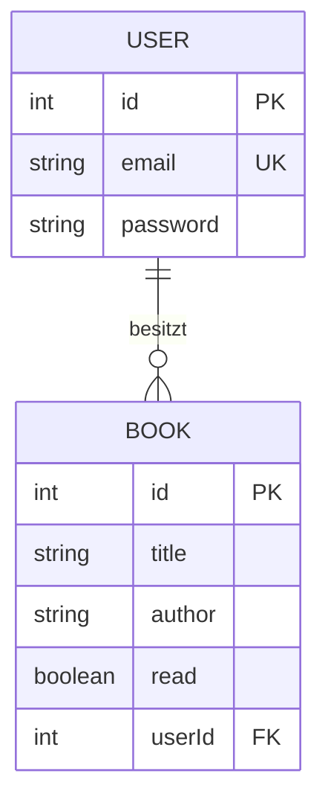

# Bücher-Leseliste-API

Eine REST-API zur Verwaltung einer persönlichen Leseliste. Benutzer können sich registrieren, anmelden und ihre eigenen Bücher anlegen, anzeigen, ändern und löschen. Jeder Benutzer sieht ausschließlich seine eigenen Bücher.


## Technologien

- Node.js und Express
- Prisma (ORM) mit SQLite
- JWT (jsonwebtoken) für die Authentifizierung
- bcrypt für das Hashen von Passwörtern

## Planung: ERD

Ein Benutzer kann mehrere Bücher besitzen (1:n-Beziehung). Jedes Buch gehört genau einem Benutzer.



## Projektstruktur

```
src/
  app.js                  Express-App und Middleware
  server.js               Server-Start
  routes/                 Routen (auth.routes.js, book.routes.js)
  controllers/            Logik der Endpunkte (auth.controller.js, book.controller.js)
  middleware/             auth.js, validate.js, errorHandler.js
  prisma/                 Prisma-Client (client.js)
prisma/
  schema.prisma           Datenmodell
.env.example              Vorlage für Umgebungsvariablen
README.md
```


## API Endpoints

### Authentication

| Method | Endpoint         | Beschreibung                       | Auth |
| ------ | ---------------- | ---------------------------------- | ---- |
| POST   | `/auth/register` | Neuen Benutzer registrieren        | ❌    |
| POST   | `/auth/login`    | Benutzer anmelden und JWT erhalten | ❌    |

### Books

| Method | Endpoint     | Beschreibung                                                                        | Auth |
| ------ | ------------ | ----------------------------------------------------------------------------------- | ---- |
| GET    | `/books`     | Alle Bücher des eingeloggten Benutzers abrufen (optional Filter `?read=true\|false`) | ✅    |
| GET    | `/books/:id` | Ein bestimmtes Buch abrufen                                                         | ✅    |
| POST   | `/books`     | Neues Buch erstellen                                                                | ✅    |
| PUT    | `/books/:id` | Buch aktualisieren                                                                  | ✅    |
| DELETE | `/books/:id` | Buch löschen                                                                        | ✅    |

